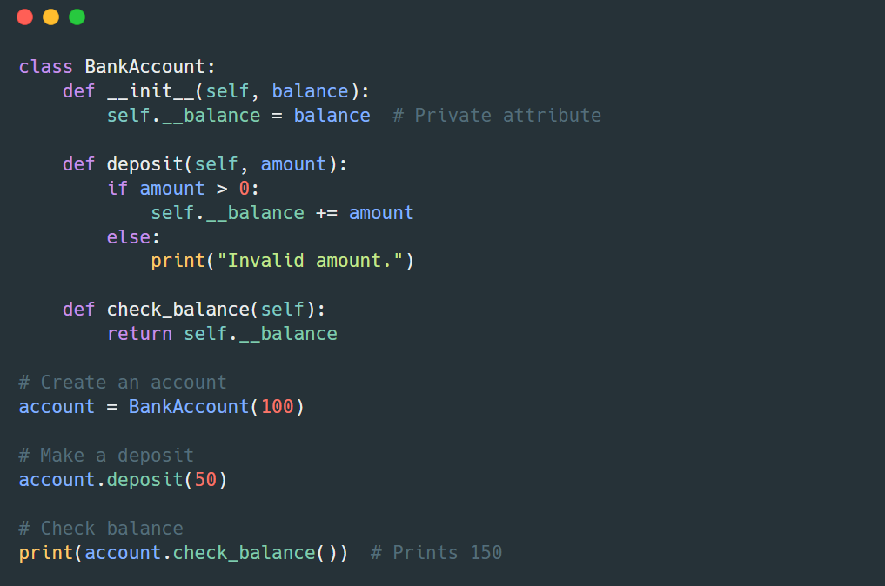

# ¡Manteniendo Nuestro Código Seguro y Organizado! 🔒

Para esta sección aprenderemos sobre algo llamado **encapsulación**. Aunque suene complicado, ¡es como tener una caja fuerte para tus datos! 

Vamos a ver qué significa en la programación.

## ¿De qué se trata? 📦

Imagina que tienes una alcancía:

- Puedes poner dinero a través de la ranura (esto es como agregar información a la clase).
- Puedes usar un código para obtener la cantidad de dinero que hay dentro (esto sería consultar la información de manera controlada).
- Pero no puedes agarrar directamente el dinero dentro de la alcancía, ¡porque está protegido!

Eso es lo que hace la encapsulación en programación: organiza y "protege" los datos para que no se modifiquen de manera incorrecta.

## ¿Por qué necesitamos esto? 🤔

Piensa en tu teléfono:
- No necesitas saber cómo funciona por dentro para usarlo.
- El sistema operativo y las funciones están protegidas dentro de la carcasa, y tú solo interactúas con lo que está permitido.
  
De manera similar, la encapsulación nos ayuda a:
- Mantener nuestro código seguro y evitar errores accidentales.
- Cambiar la manera en que funciona algo sin afectar otras partes del código.
- Mantener el código organizado y fácil de entender.

## Las partes importantes 🎯

1. **Hacer Datos Privados**
   - Algunas veces, necesitamos que los datos de una clase sean privados, es decir, que solo la propia clase los pueda modificar.
   - En Python, usamos `__` antes de los nombres para hacerlo, como `__balance` en una alcancía.
   - Esto nos ayuda a evitar que otras partes del programa cambien estos datos accidentalmente.

2. **Datos Protegidos**
   - Otros datos pueden ser "protegidos", lo que significa que están disponibles para que otras partes del programa los usen, pero solo con precaución.
   - Usamos `_` antes del nombre para estos atributos, como `_codigo_seguro`.
   - Son más accesibles que los datos privados, pero aún así les damos cierta protección para evitar el acceso sin control.

3. **Acceso Seguro a los Datos**
   - Creamos *métodos especiales* para acceder y modificar los datos privados o protegidos de manera segura.
   - Es como si tuvieses un cajero en lugar de poder abrir la caja fuerte tú mismo. El cajero te permite acceder a lo que necesitas sin arriesgar que el sistema se dañe.

Aquí tienes un ejemplo de encapsulación en Python:

En este caso, el atributo **__balance** es privado y solo se puede modificar a través del método deposito. Nadie puede cambiarlo directamente desde fuera de la clase.

## La Forma Especial de Python 🐍

En Python, es importante saber que la encapsulación no "bloquea" completamente los datos, sino que nos ayuda a organizarlos y restringir el acceso de forma responsable.

1. Usamos `__` y `_` como señales de advertencia para no acceder a ciertos atributos directamente.
2. Si bien Python no impide que accedamos a estos atributos, es una buena práctica seguir estas convenciones para que nuestro código sea más seguro y organizado.

Ahora bien, en los próximos ejercicios, practicaremos estas ideas con ejemplos divertidos. ¡lo haremos paso a paso! 🌟