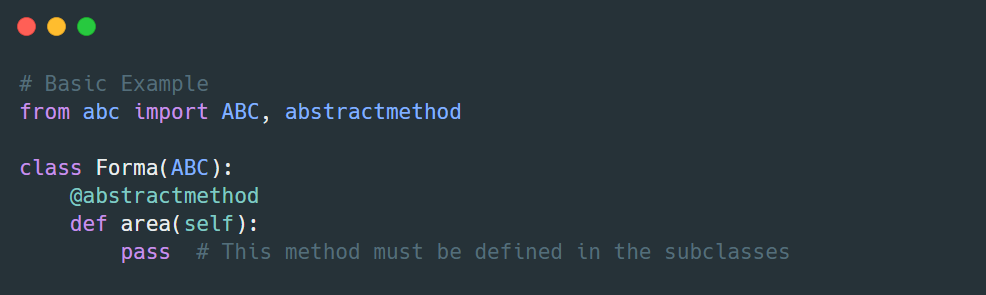

# ¡Construyendo un sistema de reproductor multimedia! 🎵

En este ejercicio, aprenderás cómo usar **clases abstractas** en Python para crear reglas compartidas entre clases relacionadas y cómo sobrescribir métodos abstractos en clases derivadas para implementar comportamientos específicos, a través de la creación de un sistema que pueda reproducir música y videos.

Antes de iniciar recordemos que las **clases abstractas** son plantillas para otras clases. Te ayudan a garantizar que todas las clases relacionadas sigan ciertas reglas.  

- Contienen **métodos abstractos**, que son como promesas y deben ser definidos en las clases que heredan de ellas.  
- No puedes crear objetos directamente a partir de una clase abstracta.



## Instrucciones

1. Crea una clase llamada `MediaPlayer`. Esta clase debe ser abstracta, lo que significa que no se puede usar directamente. Dentro de esta clase, define métodos abstractos llamados: `play`, `pause` y `stop`. Estos métodos no tendrán contenido, solo los nombres.

2. Crea una clase llamada `AudioPlayer` que herede de `MediaPlayer`. Esto significa que AudioPlayer usará los métodos de MediaPlayer. En AudioPlayer, define los métodos `play`, `pause`, `stop` con contenido. Esta clase solo manejará archivos de audio. Ejemplo:

```python
class AudioPlayer(MediaPlayer):
    def __init__(self, file_name):
        super().__init__(file_name)
    
    def play(self):
        print("Playing audio")
    
    def pause(self):
        print("Audio paused")
    
    def stop(self):
        print("Audio stopped")
```

3. Crea una clase llamada `VideoPlayer` que también herede de MediaPlayer. En VideoPlayer, define los métodos `play`, `pause`, `stop` con contenido, igual que en AudioPlayer. 

4. Adicionalmente, agrega un método llamado `show_video` a la clase `VideoPlayer` que mostrará un print() con un mensaje del video mientras se reproduce. Ejemplo:

```python
"Displaying video on screen: {file_name}"
```

5. **Prueba tu solución.** Crea instancias de la clase `AudioPlayer` y `VideoPlayer` y verifica que funcionen correctamente.

```python
# Example Code
audio = AudioPlayer("song.mp3")
video = VideoPlayer("video.mp4")

audio.play()
audio.pause()
audio.stop()

video.play()
video.show_video()
video.stop()
```

## 💡 Consejos

- Usa `ABC` y `abstractmethod` del módulo `abc` de Python
- Los métodos abstractos son como promesas, es como decir "¡Definiré esto más tarde!"
- Cada reproductor debe tener todos los métodos requeridos `play`, `pause`, 
`stop`
- Piensa en lo que cada tipo de reproductor necesita hacer.
